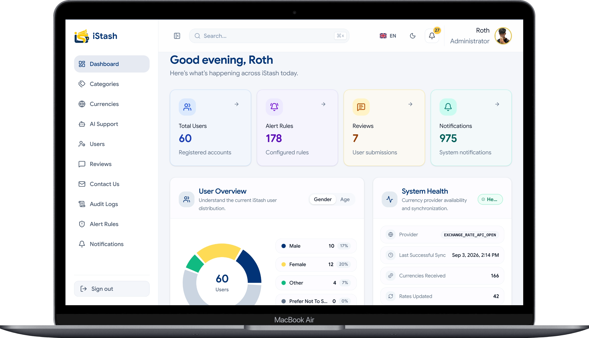
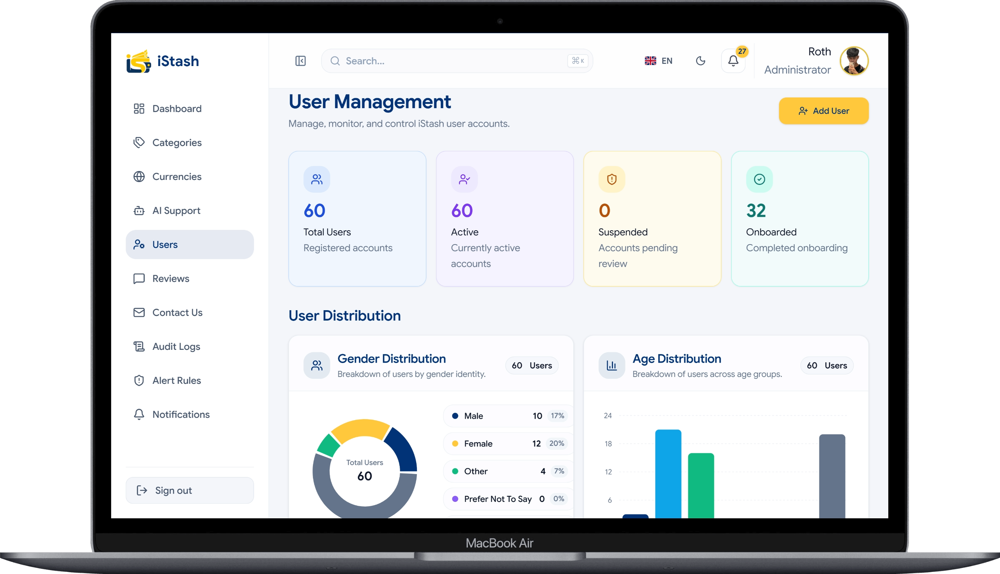
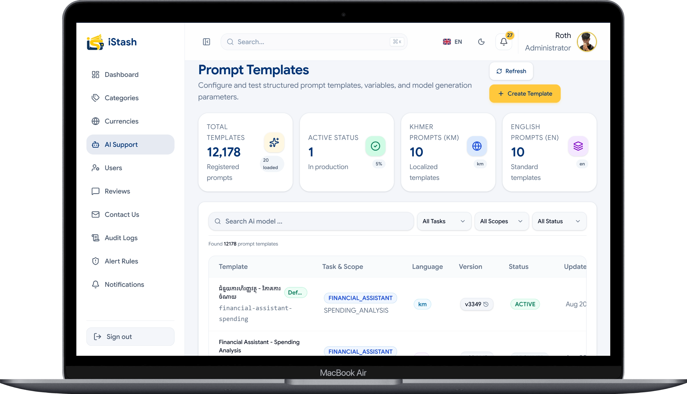
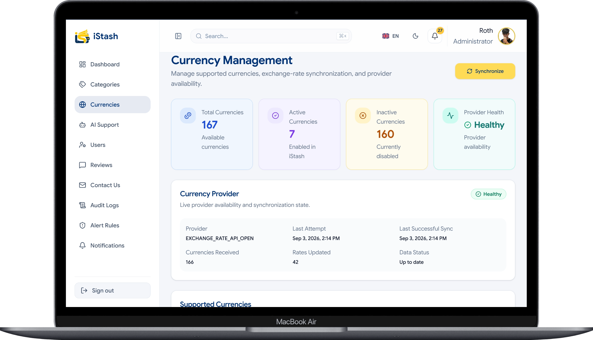

# iStash Admin

<p align="center">
  
</p>

<p align="center">
  <strong>Smart financial administration, from one powerful dashboard.</strong>
</p>

<p align="center">
  <a href="#-what-is-istash-admin">What is iStash?</a> •
  <a href="#-features">Features</a> •
  <a href="#-platform-preview">Preview</a> •
  <a href="#-getting-started-developers">Getting Started</a> •
  <a href="#-project-structure">Structure</a>
</p>

<p align="center">


</p>

---

## What is iStash Admin?

iStash Admin is a centralized administration platform built for the
**iStash financial ecosystem**.

It provides administrators with a secure and intelligent workspace to
manage users, monitor system activity, configure AI-powered services,
manage currencies, control notifications, review audit logs, and
analyze financial information.

The platform brings essential financial administration tools together
in one modern dashboard — helping teams **manage operations, understand
data, and make better decisions**.

### Core principles

- **Visibility** — understand what is happening across the platform.
- **Control** — manage users, services, and system configuration.
- **Intelligence** — use data and AI to support better decisions.

---

## Live Application

🔗 **Admin Portal:**  
[Open iStash Admin](https://admin.istashkh.com/)

> Access may require administrator authentication through the
> configured identity provider.

---

# Features

### 📊 Dashboard & Analytics

A centralized overview of the iStash ecosystem.

- User statistics
- System activity
- Financial overview
- User distribution
- System health monitoring
- Currency provider status
- Operational metrics
- Visual data analysis

---

### 👥 User Management

Manage and monitor users from a centralized administration interface.

- View users
- Search and filter users
- User profile information
- Account status
- Account activation / deactivation
- User lifecycle management
- Administrative actions

---

### 🤖 AI Configuration

Configure intelligent financial assistance from the administration
dashboard.

- AI service configuration
- Prompt management
- AI settings
- OCR-related configuration
- AI metrics
- Intelligent financial assistance

---

### 💱 Currency Management

Manage currencies and synchronize exchange-rate information.

- View supported currencies
- Activate / deactivate currencies
- Exchange-rate synchronization
- Provider status
- Synchronization status
- Currency configuration

---

### 🔔 Smart Notifications

Manage communication between the platform and users.

- Notification management
- Broadcast notifications
- Notification activity
- Delivery status
- Mark as seen
- Delivery retry
- Activity summaries

---

### 🧾 Audit Logs

Track important administrative actions across the platform.

- User activity
- Entity changes
- Administrative operations
- Resource-level actions
- Audit history
- System accountability

> **Who did what, when, and to which resource?**

---

### 📈 Reports

Analyze financial and operational information.

- Income reports
- Expense reports
- Budget reports
- Financial summaries
- Data export

---

### 🏷️ Categories

Manage financial categories used throughout the iStash ecosystem.

- Category management
- Category configuration
- Category organization
- Financial classification

---

### 💬 Feedback & Contact Management

Manage communication received from users.

- User feedback
- Contact requests
- Submission management
- Review and response workflows

---

### ⚙️ Settings & Profile

Personalize and configure the administration experience.

- Administrator profile
- Profile editing
- Avatar management
- Appearance settings
- Currency preferences
- Notification preferences
- Password management

---

### 🔐 Secure Authentication

Enterprise-oriented authentication and identity management.

- Keycloak integration
- Better Auth
- OpenID Connect (OIDC)
- OAuth authentication
- Protected routes
- Secure sessions
- Identity provider integration

---

### 🌐 Khmer & English

Designed for a localized Cambodian financial ecosystem.

- 🇰🇭 Khmer
- 🇬🇧 English
- Internationalization-ready architecture

---

# Platform Preview

The iStash Admin interface is designed around a clean,
modern **Fintech / Enterprise SaaS** experience.

### Dashboard

<p align="center">
  
</p>

The dashboard provides administrators with an at-a-glance view of
users, alerts, reviews, notifications, and overall system health.

### User Management

<p align="center">
  
</p>

### AI Configuration

<p align="center">
  
</p>

### Currency Management

<p align="center">
  
</p>

> Add the corresponding screenshots to
> `public/readme/` before publishing the README.

---

# Tech Stack

| Category         | Technology               |
| ---------------- | ------------------------ |
| Framework        | Next.js 16               |
| Frontend         | React 19                 |
| Language         | TypeScript               |
| Styling          | Tailwind CSS 4           |
| State Management | Redux Toolkit            |
| API Client       | Axios                    |
| Authentication   | Better Auth + Keycloak   |
| Validation       | Zod                      |
| Forms            | React Hook Form          |
| Charts           | Recharts                 |
| Animation        | Framer Motion            |
| Icons            | Lucide React + Iconify   |
| Notifications    | Sonner + React Hot Toast |
| Theme            | next-themes              |
| Date Utilities   | date-fns                 |
| Code Quality     | ESLint                   |

---

# Architecture

iStash Admin uses a **feature-based architecture** with the
**Next.js App Router**.

```text
                        iStash Admin
                             │
              ┌──────────────┼──────────────┐
              │              │              │
              ▼              ▼              ▼
          UI Layer      Feature Layer    API Layer
              │              │              │
              │              │              │
        Components       Business Logic     Axios
        Layouts          State Management   API Routes
        UI Elements      Validation         Auth
              │              │              │
              └──────────────┼──────────────┘
                             │
                             ▼
                     iStash Backend
                             │
              ┌──────────────┼──────────────┐
              ▼              ▼              ▼
           Users         Financial       Notification
          Services        Services          Services

          Project Structure

          .
├── public/
│   ├── categories/              # Category assets
│   ├── fonts/                   # Font assets
│   ├── icons/                   # Application icons
│   └── readme/                  # README screenshots
│
├── src/
│   │
│   ├── api/                     # API clients and integrations
│   │
│   ├── app/                     # Next.js App Router
│   │   │
│   │   ├── (auth)/              # Authentication pages
│   │   │   ├── forgot-password/
│   │   │   ├── login/
│   │   │   └── register/
│   │   │
│   │   ├── (dashboard)/         # Protected admin application
│   │   │   ├── dashboard/
│   │   │   ├── user-manager/
│   │   │   ├── notifications/
│   │   │   ├── currencies/
│   │   │   ├── categories/
│   │   │   ├── audit-logs/
│   │   │   ├── reports/
│   │   │   ├── ai-config/
│   │   │   ├── alert/
│   │   │   ├── feedback/
│   │   │   ├── contact-us/
│   │   │   ├── profile/
│   │   │   ├── search/
│   │   │   └── settings/
│   │   │
│   │   └── api/                 # API route handlers
│   │       ├── auth/
│   │       ├── keycloak/
│   │       └── v1/
│   │
│   ├── components/
│   │   ├── common/              # Shared components
│   │   ├── layout/              # Layout components
│   │   ├── pwa/                 # PWA components
│   │   ├── system/              # System components
│   │   └── ui/                  # Reusable UI components
│   │
│   ├── config/                  # Application configuration
│   ├── constants/               # Shared constants
│   │
│   ├── features/                # Feature-based modules
│   │   ├── ai-config/
│   │   ├── alert/
│   │   ├── audit-logs/
│   │   ├── auth/
│   │   ├── categories/
│   │   ├── contact-us/
│   │   ├── currencies/
│   │   ├── dashboard/
│   │   ├── feedback/
│   │   ├── notifications/
│   │   ├── profile/
│   │   ├── reports/
│   │   ├── search/
│   │   ├── settings/
│   │   └── user-manager/
│   │
│   ├── hooks/                   # Custom React hooks
│   ├── i18n/                    # Internationalization
│   │
│   ├── lib/                     # Shared utilities
│   │   └── auth/
│   │
│   ├── redux/                   # Redux store and state
│   ├── styles/                  # Global styles
│   └── types/                   # Shared TypeScript types
│
├── .env.example                 # Environment template
├── eslint.config.mjs            # ESLint configuration
├── next.config.ts               # Next.js configuration
├── package.json                 # Dependencies and scripts
├── tsconfig.json                # TypeScript configuration
└── README.md
```
